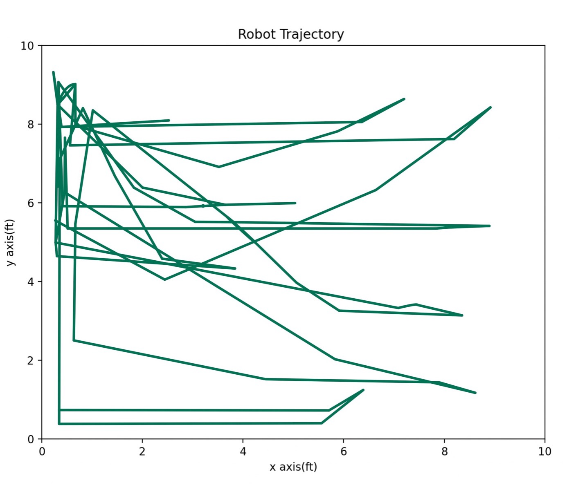

# autonomy_through_sensor_fusion

In my solo endeavor to build an autonomous vehicle, I developed a four-wheeled robot equipped with an array of sensors, including ultrasonic sensors, an IMU, and wheel encoders. By integrating image processing, obstacle detection, and localization, I have successfully infused the vehicle with self-navigation capabilities, marking a significant milestone towards achieving full autonomy.

The following shows the trajectory followed by the robot during its run for the competition

### Watch demo
https://youtu.be/nImYLZwmc6c
